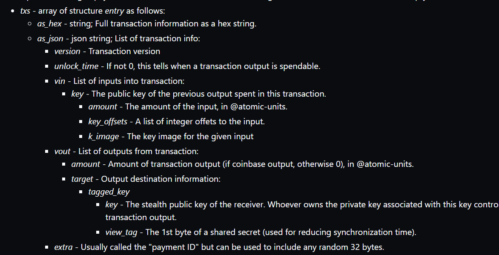
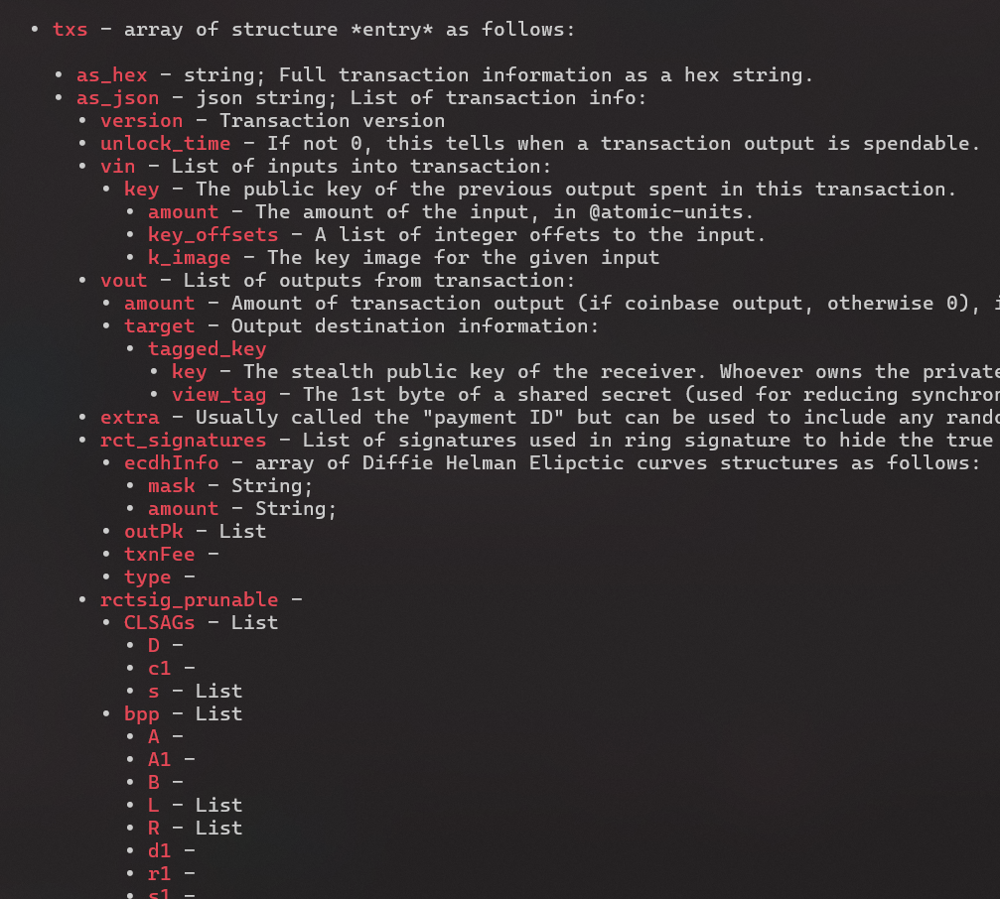

# md to roff
quick python script i made to convert md docs into roff for man pages  

Typical convertors like ronn were broken for me so instead of manually writing a 3000 lines from md to roff  

i spent 2 days automating it in python :D  

- detect h2 aka `###` and use `.SS`
- detect code blocks using and use proper intedation levels using `.RS` and `.nf`
- detecting md trees from whitespaces and properly convert them example below
- see the code more detection things

from md:  

to roff:  



# RUN
use `test.md` as a test output in `pyout.1` :D

```bash
python3 extract.py test.md
```